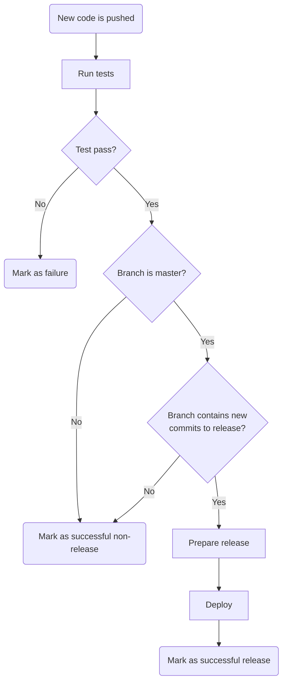

It's been [about ten years](http://web.archive.org/web/20100212123437/http://freeasinbeard.org/) since last I ran a blog.
The technological landscape has shifted a lot during those ten years, particularly in the web app space. We now have
cool things like [React](https://reactjs.org), [GraphQL](https://graphql.org), [Let's Encrypt](https://letsencrypt.org),
[Docker](https://www.docker.com), and a mature [Node.js](https://nodejs.org) ecosystem. Back then I was doing most of
my web development in Ruby and Python. In this post, I'd like to illustrate how this site is put together.<!-- jump -->

### The wonderful world of static site generation
The document you're viewing right now is served by GitHub. It's fully static content, generated at deploy time on
[Travis CI](https://travis-ci.org/). New releases are created semantically and deployed automatically, roughly
according to the following flow:



Releases are created by analyzing the messages of commits added to the master branch. Messages are parsed as
[Conventional Commits](https://www.conventionalcommits.org), which are structured as follows:

```text
<type>[optional scope]: <description>

[optional body]

[optional footer]
```

If the commit log contains one or more commits with a `type` of `fix` or `feat`, or a `footer` containing the phrase
`BREAKING CHANGE`, a new release is created. The version number is bumped accordingly in a semantic fashion:
`BREAKING CHANGE`s lead to a new major version (site redesigns), `feat`s (new content or features) lead to a new minor
version, and `fix`es (content updates or bug fixes) to a new minor version. `scope` and `description` are used to
generate a changelog.

### The beauty of GraphQL
GraphQL is an incredibly powerful query language, which can be used to fetch data from local files, web APIs, and
everything in between. I'm currently using it to query Markdown documents and assets from disk, for example to generate
the blog's index like this:

```graphql
allMarkdownRemark(sort: { fields: [frontmatter___date], order: DESC }, limit: 1000) {
	edges {
		node {
			fields {
				slug
			}
		}
	}
}
```

However, it would be trivial to for instance pull photos off of Instagram into the site feed by simply dropping in a
new data source and altering the query. From the above query, I generate one page per post and then one index
page per five posts for pagination. In the future, I might create tag-based index pages as well. The pages themselves
query deeper for the rendered Markdown and metadata.
