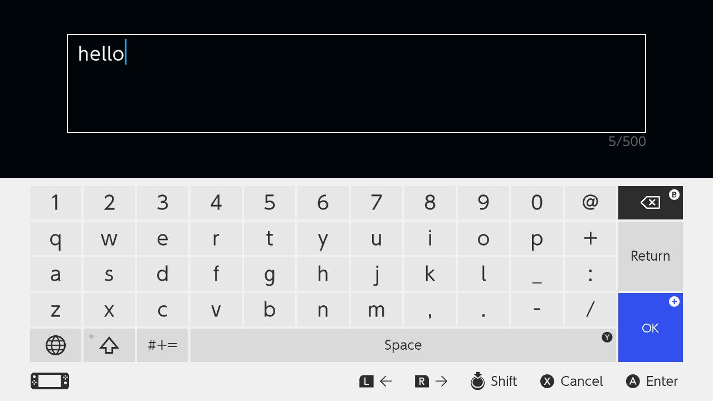

libnx is now capable of calling up system applets, including the virtual keyboard and captive portal browser. With these
two components, it should be straightforward to implement a makeshift web browser. <!-- jump -->Here's how you use the keyboard:

`embed:nintendo-switch-virtual-keyboard/main.c`

## Screenshots

