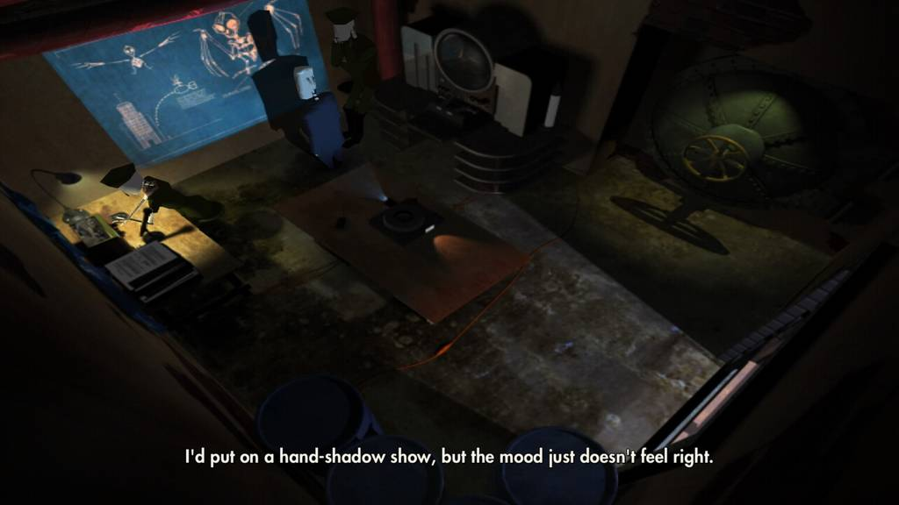

Grim Fandango remains one of my all-time favorite video games, and the remaster stays true to the original. The setting,
music, and writing are superb. It oozes charm, creativity, and a sense of atmosphere that sets it apart from many other
adventure games. But the faithful recreation leaves several gameplay aspects showing their age.<!-- jump -->

Inventory management is slow, some lengthy transitions between screens are unskippable, and some of the most obtuse
puzzles created by LucasArts in the 90's are still in this game. But despite its flaws, it's still an amazing experience!
